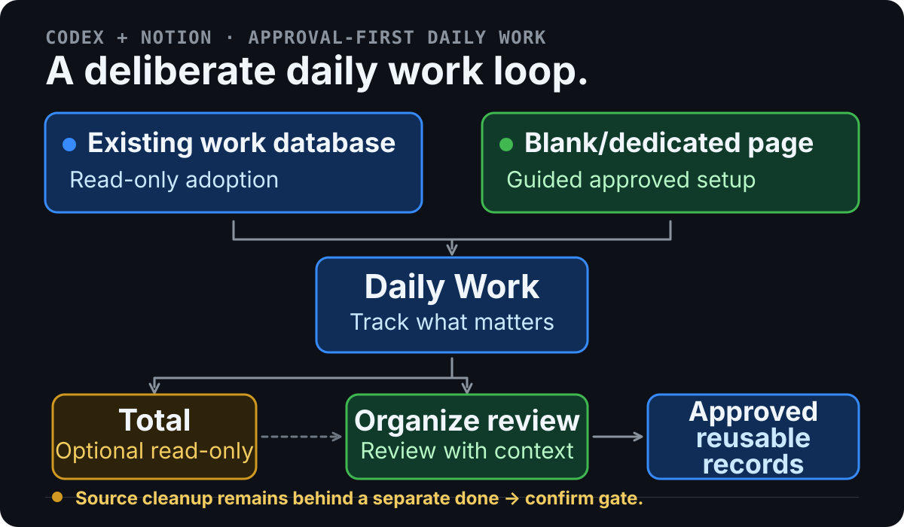
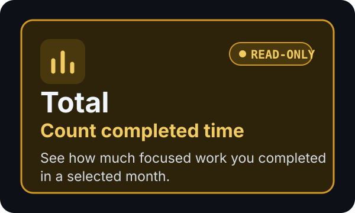
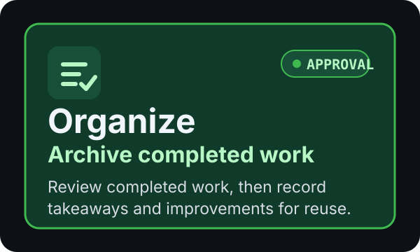

# Organize — Codex + Notion Daily Work Tracker

> An approval-first Codex + Notion starter kit for tracking daily work and
> turning completed tasks into reusable records.

**v0.3.1 PRODUCT DEVELOPMENT COMPLETE**

<!-- Organize helps you start with an existing work system or build a focused new
one, then use Total and Organize to review completed work without losing useful
takeaways. -->

Organize helps you start with an existing work system or build a focused new
one, then review completed work without losing useful takeaways.

> **Temporary availability notice:** Monthly Total is temporarily unavailable
> because the Notion Views API dependency is unavailable. Valid `total YYYY-MM`
> requests fail closed before config, credentials, Keychain, or Notion access.

<!--
<p align="center">
  
</p>
-->

## Choose Your Starting Path

### Use an Existing Work Database

Choose an existing Notion work database. Organize inspects it read-only,
reports what is ready or missing, and creates the private profile only after
the supported structure is confirmed.

### Create a New Work Database

Choose a blank or dedicated Notion page. The product suggests Categories; you
may accept, remove, rename, or add them, then explicitly confirm the current
list.

New System setup follows this single sequence:

<!-- `Blank/dedicated page → Suggested Categories → Confirm Categories → Daily Work → Verified Total view (Work Date DESC) → Category archives/mappings → Private profile → Setup complete` -->

`Blank/dedicated page → Suggested Categories → Confirm Categories → Daily Work → Category archives/mappings → Private profile → Setup complete`

<!-- After setup completes, Total and Organize are normal product features. -->

The product owns the schema, archive mappings, verified identities, and private
profile. Normal users do not need database IDs, JSON, mappings, or profile
files.

## Quick Start

Prerequisites: Git, Codex, and access to the Notion connector.

1. Clone the repository and install the Skill.

   ```sh
   git clone https://github.com/wensente9682/notion-work-organizer.git
   cd notion-work-organizer
   python3 -B skills/todo-archive-review/scripts/install.py
   ```

2. Start a Codex task and choose a path.

   ```text
   Use Organize with my existing Notion work database. Start read-only.
   ```

   ```text
   Create a new work database on my blank or dedicated Notion page. Suggest Categories and wait for my confirmation.
   ```

3. After adoption or setup completes, use the normal features.

   <!--
   total 2026-07
   -->
   ```text
   organize todo
   ```

## Core Workflow

<!-- `Choose or create → Track daily work → Total → Organize → Preserve reusable records → done → confirm` -->

`Choose or create → Track daily work → Organize → Preserve reusable records → done → confirm`

<!--
<p align="center">
  
</p>
-->

<p align="center">
  
</p>

- **Track:** record work, completion, Category, time blocks, and optional
  takeaways or improvements.
<!-- - **Total:** read completed blocks by Category from the configured saved view. -->
- **Organize:** review completed work before approving archive copies.
- **Cleanup:** `done` shows a summary; only a separate `confirm` can clean up
  eligible source rows.

## Approval-First Safety

- Planning, inspection, and preview never authorize a Notion write.
- Every New System write has an exact user-facing preview, single-use approval,
  a pre-write recheck, and at most one connector call.
- A confirmed failure, ambiguous, partial, or unknown outcome stops the flow;
  there is no automatic retry.
<!-- Total is read-only and never grants Organize approval. It is the explicit
  architectural exception: each run uses the local Python Stage 4 Views API
  wrapper with a user-managed `NOTION_TOKEN` or Keychain entry, under a
  single-use sandbox-external authorization. If that authorization is denied,
  Total stops without a connector fallback or retry. -->
- `ok` and `dismiss` do not remove source rows. Cleanup remains behind the
  separate `done` → `confirm` gate and uses Notion's recoverable archived
  state.

## Current Boundaries

- Setup, Adopt, and Organize run in Codex with the Notion connector; they are
  not standalone GUI or unattended workspace-manager paths.
- Existing-system adoption is read-only first and does not broadly repair or
  migrate unrelated Notion content.
- New System changes only the user-confirmed dedicated system through visible,
  action-by-action approval.
<!-- Total is a point-in-time calculation, not a saved dashboard or historical
reporting system.
Monthly Total is the explicit exception to connector-first operation: it
  uses local Python `run_total.py` and the Stage 4 Views API, not ordinary
  connector or data-source queries. The general Python CLI remains an advanced
  fallback, not the normal user path. -->

## Learn More

- [Existing system adoption](skills/todo-archive-review/references/adopt-existing.md)
- [New System setup](skills/todo-archive-review/references/setup.md)
- [Organize workflow](skills/todo-archive-review/references/organize.md)
- [Supported schema](docs/schema.md)
- [Sanitized review example](examples/session-output.example.txt)

If Organize helps you build a more useful daily work practice, consider
starring the repository.
