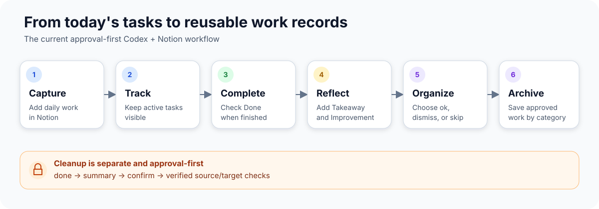

# Notion Daily Work Tracker for Codex

An open-source starter kit for building a lightweight Notion daily work
tracker—capture tasks, complete work, and organize finished items into reusable
records.

[**Try it with your Notion list →**](#quick-start)



_A workflow overview of the current Codex + Notion experience; this project does
not ship a separate GUI._

## Why Use It

- **Track daily work without maintaining a complex project-management system.**
  Keep the portable schema small while preserving your own optional fields.
- **Keep completed tasks instead of losing them.** Finished work stays available
  for review before any cleanup decision.
- **Turn daily activity into organized records for review and reflection.** Add
  takeaways and improvements, then archive useful records by category.

The project is designed for Codex users first. Codex uses the Notion connector,
not a checked-in Notion token.

## Quick Start

Prerequisites: Git, Codex, and access to the Notion connector.

1. Clone the repository and copy the skill into Codex's default personal skill
   directory:

   ```sh
   git clone https://github.com/wensente9682/notion-work-organizer.git
   cd notion-work-organizer
   mkdir -p ~/.agents/skills
   cp -R skills/todo-archive-review ~/.agents/skills/
   ```

2. Start a new Codex task and enable the Notion connector with access only to the
   Notion databases you want this workflow to use.
3. Choose the prompt that matches your starting point:

   ```text
   Use this workflow with my existing Notion to-do list. Start read-only.
   ```

   ```text
   Set up a new Notion daily work tracker. Start with a plan only.
   ```

   Already configured? Start a review with:

   ```text
   organize todo
   ```

4. Review the proposed field mapping and read-only preview. Approve each Notion
   write separately; final source cleanup has its own `done` → `confirm` gate.

For normal Codex use, do not paste a Notion token into chat or add one to project
config. See a sanitized review in
[examples/session-output.example.txt](examples/session-output.example.txt).

## What This Is

This project packages a small, portable method for tracking personal work in a
Notion to-do or work-log database:

1. Capture work in a source to-do database.
2. Mark completed rows with `Done`.
3. Reflect in `Takeaway` and `Improvement`.
4. Review each completed row as archive, dismiss, or skip.
5. Organize archive-approved rows by configured `Category`.
6. Archive approved rows into category archive tables.
7. Clean up source rows only after a separate confirmation step.

The `todo-archive-review` Codex skill guides setup, adoption, and the completed
work review flow. The Python CLI in `notion_todo_workflow.py` is the
regression-tested core and an advanced-user fallback, not the normal path for
ordinary Codex use.

## Safety Model

- Codex should use the Notion connector for normal operation.
- Normal Codex use does not require a Notion API token. The narrow developer
  fallback described below is only for verified final source cleanup when the
  connector cannot archive source pages directly.
- Public templates never include tokens, real database IDs, real Notion URLs, or
  private Notion page IDs.
- Do not commit private configs, `.todo_archive/`, local backup/cache/state
  files, real database IDs, real Notion URLs, or credentials.
- Setup and adoption are read-only by default in v0.1.
- Real Notion writes require explicit approval for the specific action.
- `done` is not cleanup approval. Source cleanup requires `confirm` after the
  user has seen the run summary and the workflow's safety checks pass.
- `dismiss` is a reviewed cleanup decision without archive output; it still
  requires `done` and then `confirm` before a source row may be removed.
- `undo` is scoped to archive copies, moved/manual-match records, and local
  action state. It does not promise to restore or modify the source row.
- Archive rows copy only `Task`, `Takeaway`, and `Improvement`.
- `Category` routes target selection only; it is not copied into archive rows.
- Local runtime files such as `.todo_archive/`, `config.test.json`, and
  `*.local.json` are private and ignored.

## Workflow Details

### Capture

Use your Notion source database as the place where active work records live. The
portable source schema is intentionally small:

- `Task`
- `Done`
- `Category`
- `Takeaway`
- `Improvement`

You can keep additional personal fields such as dates, status, priority,
project, tags, or estimates. They are outside the portable contract.
Existing workspaces with different labels can keep them by setting
`field_mapping` in the local config.

### Complete

Only rows where `Done` is checked are organize candidates. Unchecked rows are
never archived or removed by the workflow.

### Reflect

Before archive, add the reflection fields:

- `Takeaway`: takeaway, learning, or useful result.
- `Improvement`: improvement, follow-up insight, or next-time adjustment.

Rows where both fields are empty are treated as cleanup candidates when reached
in the normal scan order; they are not copied as archive-content rows.

### Organize

The workflow stages a small batch of completed rows. The user approves, dismisses,
or skips individual rows with commands such as `ok 1 3`, `dismiss 1`, or `skip 2`.
Use `ok` when the row should be copied to an archive table, `dismiss` when the
row should leave the source list without an archive copy, and `skip` when the
row should remain available for a later review.

Categories are configuration, not product constants. Public examples use
placeholder names such as `example-category`; users should replace them with
their own category names and archive targets.

### Archive

Approved rows are appended to the configured category archive table. Each
archive row contains only:

- `Task`
- `Takeaway`
- `Improvement`

Before creating a new archive row, the workflow checks the selected category
archive table for a strict manual match on the same three fields. Exact matches
are recorded as already handled instead of duplicated.

### Cleanup

Source rows stay in the source database during the batch loop. At the end,
`done` shows a summary. Only after the user replies `confirm` may checked source
rows be removed. Successfully archived rows are verified against their target
archive rows; dismissed rows are not archived and are verified against their
source snapshot before removal. Removal means setting the source page to
Notion's recoverable archived state so it leaves the active source table; it is
not a permanent destroy operation.

## Existing Notion List Path

Use this path if you already have a Notion to-do or work-log database.

Codex should inspect the existing database in read-only mode, compare it with
the portable schema, and report:

- whether the source fields can satisfy `Task`, `Done`, `Category`,
  `Takeaway`, and `Improvement`
- how your category/project/routing field can map to archive targets
- whether each archive table supports `Task`, `Takeaway`, and `Improvement`
- what local config would be needed
- the safest next step, usually a read-only preview

Adoption must not automatically migrate old rows, change schemas, create archive
tables, or remove source rows.

## New Notion System Path

Use this path if you want a fresh system.

The v0.1 setup route should first propose the smallest portable shape:

- one source to-do database
- one category routing field named `Category`
- one archive table per configured category
- a local private profile based on the example config
- a read-only preview before any write path

Setup may draft a plan and config. It must not automatically create databases,
fields, rows, ledgers, or archive tables without explicit approval for that
specific Notion write.

## Required Schema

See [docs/schema.md](docs/schema.md) for the full portable contract.

Required source database properties:

| Property | Notion type | Purpose |
| --- | --- | --- |
| `Task` | title | Work item title; copied to archive `Task`. |
| `Done` | checkbox | Completion gate. |
| `Category` | rich_text, relation, select, or mapped equivalent | Routes the row to one or more archive categories. |
| `Takeaway` | rich_text | Takeaway copied into the archive row. |
| `Improvement` | rich_text | Improvement note copied into the archive row. |

Required archive table properties:

| Property | Notion type | Purpose |
| --- | --- | --- |
| `Task` | title | Copied from the source row. |
| `Takeaway` | rich_text | Copied from the source row. |
| `Improvement` | rich_text | Copied from the source row. |

Archive tables should not mirror the full source database. Source-only workflow
fields such as `Done`, `Category`, relations, status, dates, and private metadata
remain source-side fields unless a future tested extension adds them.

## Config Examples

Public templates are sanitized:

- [config.example.json](config.example.json)
- [real_profile.example.json](real_profile.example.json)

## Examples

See [examples/](examples/) for minimal source schema, archive schema, category
mapping, and sample session output files that use neutral placeholder data.

Sandbox/test-style profile:

```json
{
  "source_database_id": "YOUR_TODO_SOURCE_DATABASE_ID",
  "ledger_database_id": "YOUR_OPTIONAL_TEST_LEDGER_DATABASE_ID",
  "source_order": "bottom_first",
  "batch_size": 5,
  "move_limit": 30,
  "field_mapping": {
    "task": "Task",
    "done": "Done",
    "category": "Category",
    "takeaway": "Takeaway",
    "improvement": "Improvement"
  },
  "target_databases": {
    "example-category": "YOUR_EXAMPLE_CATEGORY_ARCHIVE_DATABASE_ID"
  }
}
```

Real-profile shape:

```json
{
  "mode": "real",
  "source_database_id": "YOUR_REAL_TODO_SOURCE_DATABASE_ID",
  "archive_tables_page_id": "YOUR_ARCHIVE_TABLES_PAGE_ID",
  "source_order": "bottom_first",
  "batch_size": 5,
  "move_limit": 30,
  "field_mapping": {
    "task": "Task",
    "done": "Done",
    "category": "Category",
    "takeaway": "Takeaway",
    "improvement": "Improvement"
  },
  "archive_tables": {
    "example-category": "example-category"
  },
  "project_categories": {
    "example-category": "YOUR_EXAMPLE_CATEGORY_PROJECT_PAGE_ID"
  }
}
```

Private profiles belong in ignored local files such as
`.todo_archive/real_profile.json`, `config.local.json`, or `*.local.json`.

Maintainers may also keep a private test profile in `config.test.json`. That file
is intentionally ignored and is not part of the public setup contract.

## CLI Fallback For Maintainers And Advanced Users

Skip this section for normal Codex use.

`notion_todo_workflow.py` exists for regression testing, local debugging, and
outside-Codex operation. Inside Codex, the skill should prefer the Notion
connector and should not switch to the CLI unless the user explicitly asks for
an external command-line workflow.

The CLI does not store credentials in repo config. If a user runs it outside
Codex, credentials are user-managed shell or Keychain state. Public templates do
not include token fields.

For outside-Codex CLI use, create an internal Notion integration, share only the
databases this workflow should access, then store the token in macOS Keychain:

```sh
read -s NOTION_TOKEN
security add-generic-password -U -a "$USER" -s codex-notion-token -w "$NOTION_TOKEN"
unset NOTION_TOKEN
```

The fallback CLI also accepts a temporary shell environment variable named
`NOTION_TOKEN`, but do not write it into project files.

Inside Codex, the Notion connector remains the default. The only real-mode
fallback/API exception is final source cleanup after `done` and `confirm`: if
the connector cannot set source pages to Notion's recoverable `archived: true`
state, maintainers may use the local fallback/API only after source rows and
target archive rows have been re-read and verified. This exception must not be
used for preview, batch selection, `ok`, manual-match checks, or archive row
creation.

Useful maintainer commands:

```sh
python3 notion_todo_workflow.py preflight
python3 notion_todo_workflow.py check
python3 notion_todo_workflow.py next
python3 notion_todo_workflow.py ok 1 3
python3 notion_todo_workflow.py dismiss 1
python3 notion_todo_workflow.py skip 2
python3 notion_todo_workflow.py done
python3 notion_todo_workflow.py confirm
python3 notion_todo_workflow.py status
python3 notion_todo_workflow.py undo 1
python3 notion_todo_workflow.py --config .todo_archive/real_profile.json preview
```

Local-only setup/adopt preflight:

```sh
python3 setup_preflight.py --config config.example.json
python3 setup_preflight.py --config config.local.json --schema local-schema.json
```

The setup preflight reads only local JSON files. It reports placeholder config,
private credential-like keys, category mapping gaps, and missing/incompatible
fields in a local schema fixture. It does not call Notion or modify any Notion
database, field, archive table, row, ledger, or safety log.

Maintenance/retry only:

```sh
python3 notion_todo_workflow.py remove-sources --confirm REMOVE_SOURCES
```

## What v0.1 Does Not Automate

- It does not automatically set up or adopt a Notion system.
- It does not automatically create real Notion databases, fields, archive
  tables, ledgers, backend pages, or safety logs.
- It does not automatically migrate old rows.
- It does not scan, repair, deduplicate, or maintain an entire workspace.
- It does not copy optional source fields into archive rows.
- It does not make final source cleanup part of `done`; cleanup remains a
  separate `confirm` step.
- It does not expose or commit private configs, real database IDs, tokens,
  `.todo_archive/`, or maintainer-only profiles.

Future versions may add more setup automation, but v0.1 intentionally keeps
setup/adopt workflows read-only by default.
